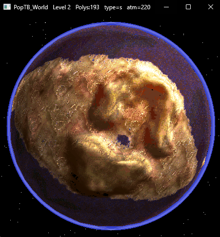
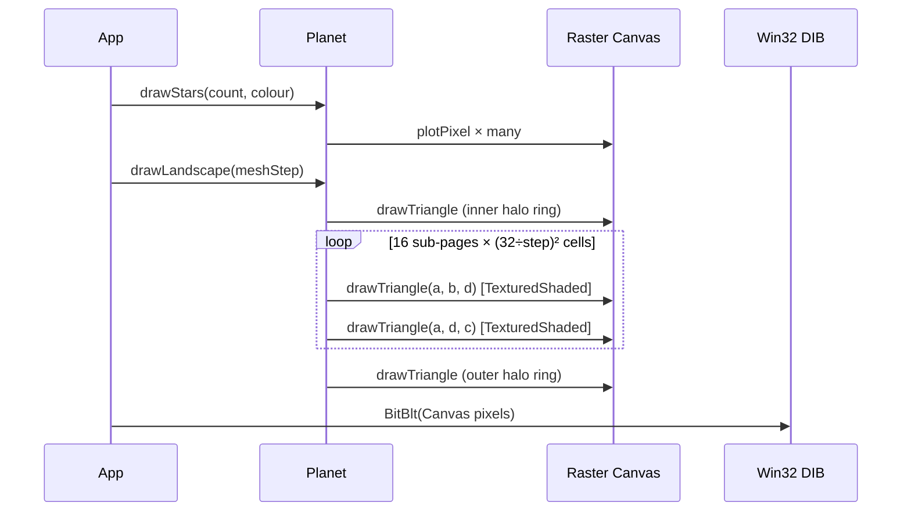

# Populous TB World Rendering System

<p align="center">
  
</p>

An educational, clean-room C++17 reimplementation of the **NewWorld** planetary
view from Bullfrog's 1998 *Populous: The Beginning*. The renderer runs
entirely in software into an 8-bit palette-indexed framebuffer and presents
the result through a plain Win32 DIB — no OpenGL, no Direct3D, no shaders.

The project exists to explain, in concrete working code, the tricks a
mid-90s team used to draw a **rotating textured globe in real time on a
Pentium-class CPU**: parabolic pseudo-sphere projection, palette-indexed
per-texel shading through 2-D lookup tables, cell-wise level-of-detail
meshes, alpha-blended atmosphere halos, and a 3-D star field rotated by
quaternion-free axis rotations.

---

## Table of Contents

1. [What the app does](#1-what-the-app-does)
2. [Using the viewer](#2-using-the-viewer)
3. [Building from source](#3-building-from-source)
4. [The mathematics](#4-the-mathematics)
   - [4.1 Fixed-point arithmetic (Q9 / Q16)](#41-fixed-point-arithmetic-q9--q16)
   - [4.2 The parabolic "fudged sphere"](#42-the-parabolic-fudged-sphere)
   - [4.3 Inverse projection — screen → map](#43-inverse-projection--screen--map)
   - [4.4 Per-cell lighting (Lambert + rim)](#44-per-cell-lighting-lambert--rim)
   - [4.5 Bilinear interpolation per cell](#45-bilinear-interpolation-per-cell)
   - [4.6 Atmosphere ring geometry](#46-atmosphere-ring-geometry)
   - [4.7 3-D star field rotations](#47-3-d-star-field-rotations)
5. [The rendering system](#5-the-rendering-system)
6. [Data file structure](#6-data-file-structure)
7. [Level file structure](#7-level-file-structure)
8. [Credits & license](#8-credits--license)

---

## 1. What the app does

Given a Populous level file and the per-landscape-type lookup tables, the
viewer produces a rotating, pan-able **globe** view of that map. You see:

- The 128 × 128 height-field, wrapped onto a "fudged" sphere.
- Per-cell sun-based shading.
- Per-texel displacement noise that gives the terrain its grainy,
  painted-on feel.
- An alpha-blended atmosphere halo along the silhouette.
- A perspective-projected 3-D star field that rotates like an orbital
  camera's view.

Everything renders into a single 8-bit palette-indexed surface, which is
then presented via a Win32 DIB at whatever resolution the window is.

### High-level dataflow

```mermaid
flowchart LR
    LEVL["levels/LEVL*.DAT<br>(altitudes, levelType)"] --> LOADER[Level loader]
    LEVLHDR["levels/LEVL*.HDR<br>(v2 metadata)"] --> LOADER
    LOADER --> ALTS[(altitudes[128x128])]
    LOADER --> META[(metadata)]
    META --> PICK[Pick level-type<br>tables]
    BIG["data/bigf0-N.dat"] --> PICK
    DISP["data/disp0-N.dat"] --> PICK
    PICK --> TEXBUILD[Texpage builder]
    ALTS --> TEXBUILD
    TEXBUILD --> TEXPAGE[(256x4096<br>palette atlas)]
    PAL["data/pal0-N.dat"] --> PALSET[Palette install]
    FADE["data/fade0-N.dat"] --> RENDER
    AL["data/al0-N.dat"] --> RENDER
    TEXPAGE --> RENDER[Planet renderer]
    PALSET --> DIB[Win32 DIB]
    RENDER --> FB[(8bpp framebuffer)]
    FB --> DIB
    DIB --> SCREEN[Window]
```

---

## 2. Using the viewer

Run `build_output/World.exe`. By default it loads level `LEVL2002`. You can
specify any other level either by filename or by its numeric suffix:

```
World.exe                  # loads levels/LEVL2002.DAT
World.exe 2001             # loads levels/LEVL2001.DAT
World.exe LEVL2005.DAT     # loads levels/LEVL2005.DAT
World.exe C:\path\foo.dat  # absolute path also works
```

### Controls

| Input                | Action                                            |
|---                   |---                                                |
| Right-mouse drag     | Pan the globe (inertial spin after release)       |
| `[` / `]`            | Step the atmosphere colour through the palette    |
| `<` / `>`            | Step the level-type character (palette override)  |
| `M`                  | Toggle horizontal mirror                          |
| `N`                  | Toggle vertical mirror                            |
| `F5`                 | Reload the current level                          |
| Window frame drag    | Resize — aspect is locked 1:1                     |

The title bar always shows the current level name, triangle count, current
level-type character, and atmosphere-palette index.

### Data layout on disk

```
build_output/
├── World.exe
├── data/                  <- lookup tables, 36 variants per table
│   ├── pal0-0.dat ... pal0-z.dat
│   ├── fade0-0.dat ... fade0-z.dat
│   ├── al0-0.dat  ... al0-z.dat
│   ├── bigf0-0.dat ... bigf0-z.dat
│   └── disp0-0.dat ... disp0-z.dat
└── levels/
    ├── LEVL2001.DAT       <- LEVL3-format level
    ├── LEVL2002.DAT       <- older LEVL2-format level
    └── LEVL2002.HDR       <- companion header for LEVL2 levels
```

---

## 3. Building from source

### Dependencies

- **CMake ≥ 3.16**
- **Windows SDK** — the viewer uses GDI for presentation, so it's Win32-only.
  The renderer itself (the `PopTBWorld` static library) is portable C++17
  and builds on any toolchain.
- **MSVC (Visual Studio 2019 or 2022)** or any recent C++17 compiler.

No third-party libraries. No package manager needed.

### Building

From a Developer Command Prompt, or any shell that has `cmake` + a C++
toolchain in `PATH`:

```bash
cd NewWorld
cmake -B build -G "Visual Studio 17 2022" -A x64
cmake --build build --config Release
```

The library `PopTBWorld.lib` lands under `build/Release/`, and the viewer
exe lands at `build_output/World.exe` next to the data/ and levels/
directories so it can find them at runtime.

### CMake options

| Option                | Default | Effect                                          |
|---                    |---      |---                                              |
| `PTW_BUILD_VIEWER`    | `ON`    | Build the Win32 viewer as well as the library.  |

---

## 4. The mathematics

This is the heart of the educational content. The 1998 engine had to draw a
believable rotating globe on a CPU that couldn't afford a single `sin()`
per pixel. Every trick below is motivated by that constraint.

### 4.1 Fixed-point arithmetic (Q9 / Q16)

Floating-point was expensive on 1990s CPUs, so Populous did almost
everything in scaled integers.

- **Q9** format stores one map cell as `512` units (`1 << 9`).
  An altitude or scroll position has 9 fractional bits.
- **Q16** format stores one texel or one shade level as `65536` units
  (`1 << 16`). 16 fractional bits gives texture DDAs enough precision to
  walk a 256-pixel span without visible drift.

Useful operations (all in the same fixed-point format):

```cpp
int32_t mul16(int32_t a, int32_t b) { return (int64_t(a) * b) >> 16; }
int32_t div16(int32_t a, int32_t b) { return (int64_t(a) << 16) / b;  }
```

A value `v` in Q9 corresponds to a real number `v / 512`. Most of the
renderer consumes Q9 scroll offsets and Q16 UV/shade deltas.

### 4.2 The parabolic "fudged sphere"

A full lat/long sphere projection needs `sin()` and `cos()` per vertex.
Populous side-stepped that with a **paraboloid approximation**:

Given a map offset `(x, y)` from the scroll centre (in cell units), compute

```
z  =  projDepth + x² + y²
r  =  projScale / z
sx =  centerX + x·r
sy =  centerY + y·r
```

Visually this looks like a sphere as long as `projDepth` and `projScale`
are tuned so that points at the intended **horizon** (a map distance of
`mapRadius` cells from the scroll) land exactly on the screen silhouette.
Those calibration values are derived from the caller's choice of on-screen
radius `R` and world-space map radius `M`:

```
projDepth = M²
projScale = 2 · R · M
```

With those plugged in, setting `x = M, y = 0` gives `z = 2M²` and
`r = 2RM/(2M²) = R/M`, so the horizon cell lands at `center ± R` — exactly
on the edge of the planet silhouette.

#### Why it looks spherical

Compare a real orthographic sphere, which compresses toward the edge
through `cos(angle)`, with the paraboloid's `1/z` falloff:

```
real ortho      paraboloid
x_on_screen =   R · sin(atan(x/√(M²-x²)))
x_on_screen =   x · 2RM / (M² + x² + y²)
```

For `|x| ≤ M/2`, these two curves agree to within a couple of pixels. Only
near the very edge does the paraboloid bend less dramatically — which is
hidden anyway by the atmosphere halo drawn over the silhouette.

#### The wrap trick (`<<16, >>16`)

The map is a 128-cell **torus**. When you scroll far east, the far-east
cells should reappear at the west edge of the sphere. The engine achieves
this by sign-extending the low 16 bits of a Q9 offset:

```cpp
int32_t wrap = (int32_t(dx) << 16) >> 16;
```

That clips `dx` into the range `[-32768, +32767]` (Q9 = ±64 cells), which
makes the parabolic `z` symmetric around the scroll centre and keeps every
projected vertex inside the visible hemisphere.

### 4.3 Inverse projection — screen → map

When the user clicks or drags, we need the inverse operation:
given a screen pixel, which map cell is under the cursor?

Starting from

```
x_scr/projScale = x / (projDepth + r²)
```

and writing `r = √(x² + y²)`, the forward projection reduces to a scalar
equation `d(r)` and the inverse becomes a simple quadratic in `d`:

```
d = (1 − √(1 − 4·projDepth·r_scr²)) / (2·r_scr)
```

where `r_scr` is the normalised screen distance from the sphere centre.
The sign of the square root picks the near-side solution. Finally we
rotate `d` back to `(dx, dy)` using the screen polar angle:

```cpp
mapX_offset = d · sin(angle)
mapY_offset = d · cos(angle)
```

If the discriminant `1 − 4·projDepth·r_scr²` is negative, the point is
outside the sphere silhouette and we return "miss".

### 4.4 Per-cell lighting (Lambert + rim)

Lighting uses a fixed sun direction equal to `(1, 1, 1)/√3` (the engine
stores it as three `147` components — roughly `255/√3`). For each cell we
approximate the local surface normal by differencing altitude to the +X
and +Z neighbours:

```
s = 147 − dhX·147 − dhZ·147
s /= 350
s += 128
```

`s` is used directly as the **shade column** into the `bigfade` LUT.
The divisor 350 was picked so that typical altitude slopes give a shade
swing of about ±40 around 128, which maps to visibly distinct colour rows
inside the palette's lit-to-shadow gradient.

An additional "cliff" metric helps separate sloped land from water:

```
cliff = (maxAlt − minAlt) / 8       # across the 3×3 cell neighbourhood
```

Cells whose 3×3 window spans more than 8 altitude units get an **extra
+75** added to their altitude at bigfade-lookup time. That guarantees
sloped cells stay safely above the water band, which is why the in-game
continents don't develop phantom lakes on their inland slopes.

### 4.5 Bilinear interpolation per cell

Each 1 × 1 map cell is drawn as an 8 × 8 texel block. Both altitude and
shade are **bilinearly interpolated across the block from the four corner
values**. Symbolically, for a texel at fractional position `(u, v) ∈ [0,1)²`
within the cell:

```
value(u, v) = (1-u)(1-v)·TL
            +     u (1-v)·TR
            + (1-u)   v  ·BL
            +     u    v ·BR
```

An efficient integer-only version expresses the weights in eighths:

```cpp
wx  = tx; iwx = 8 - tx;   // tx, ty ∈ [0, 7]
wy  = ty; iwy = 8 - ty;
out = (TL·iwx·iwy + TR·wx·iwy + BL·iwx·wy + BR·wx·wy) / 64;
```

This is done once for altitude and once for shade, per texel. Both become
LUT indices into the `bigfade` table (§6).

### 4.6 Atmosphere ring geometry

The halo around the planet uses a very old trick: **scanline circle fill
through an alpha-blend LUT**. For each scanline `y` in `[cy − r2, cy + r2]`:

```
dy     = y − cy
outerX = √(r2² − dy²)
innerX = dy² < r1²  ?  √(r1² − dy²)  :  0
```

Then we fill two spans per row — `[cx−outerX, cx−innerX]` and
`[cx+innerX, cx+outerX]` — with a shade that linearly interpolates from
`shadeOut` at the rim to `shadeIn` at the inner edge. Each pixel is
written as `fade[shade][tint]` where `tint` is whatever palette index
reads as "blue" in the current level's palette.

### 4.7 3-D star field rotations

Every star is a fixed random **unit direction vector** sampled once per
frame from a seeded PRNG (uniform over the sphere: longitude ∈ [0, 2π],
`cosLat ∈ [-1, 1]`). Pan and scroll accumulate into two angles:

- `yaw` rotates the entire sky around the Y axis.
- `pitch` rotates it around the X axis.

At render time we rotate each star's direction by the accumulated angles,
discard anything with `z ≤ 0` (behind the camera), and project the
remainder with a **90° horizontal field-of-view perspective**:

```
screenX = cx + (x / z) · halfWindowWidth
screenY = cy + (y / z) · halfWindowWidth
```

The `1/z` division is what gives the characteristic porthole-view look:
stars near the centre move fastest when you pan, stars near the edges
slow to a crawl, and a full 360° pan swings the whole hemisphere of
stars across the screen and out the other side.

---

## 5. The rendering system

### 5.1 Per-frame pipeline



The atmosphere ring is drawn **twice** — once under the terrain (inner
rim) and once over the terrain at the outer edge. Layering the ring
around the landscape is what produces the faint volumetric glow on the
silhouette instead of a hard-edged disc.

### 5.2 The 256 × 4096 texpage

For each level we generate a 1 MiB "texpage" at load time. It's laid out
as 16 sub-pages stacked linearly — one sub-page per 32 × 32-cell block of
the map:

```
Sub-page (subX, subZ):  byte offset = (subZ · 4 + subX) · 65536
Inside a sub-page:      row-major 256 × 256 palette indices
Each map cell:          an 8 × 8 texel block
                        at sub-page offset (cellLocalZ · 8) · 256 + cellLocalX · 8
```

The renderer emits two textured-shaded triangles per cell quadrant. Each
triangle picks its sub-page from `(cellX >> 5, cellZ >> 5)` and samples
the 8 × 8 region via UVs in `[0, 256]` (16.16 fixpt).

### 5.3 The scanline triangle rasterizer

`raster.cpp` is a plain 8-bpp scanline rasterizer. It walks each
triangle top-to-bottom with DDAs for `(x, u, v, shade)` and supports five
fill modes:

| Mode                 | Reads                   | Writes                          |
|---                   |---                      |---                              |
| `Solid`              | `tint`                  | `*dst = tint`                   |
| `SolidShaded`        | `tint`, `shade`         | `*dst = fade[shade][tint]`      |
| `Textured`           | `texpage`               | `*dst = texpage[v·256 + u]`     |
| `TexturedShaded`     | `texpage`, `shade`      | `*dst = fade[shade][sample]`    |
| `AlphaBlend`         | `tint`, existing `*dst` | `*dst = alpha[tint][*dst]`      |

UV coordinates are **clamped** (not wrapped) at the sub-page boundary so
a vertex that lands exactly on the right/bottom edge samples the last
texel instead of wrapping around — that's what eliminates the 1-pixel
seam lines that otherwise appear at every 32-cell border.

### 5.4 The displacement map — why the terrain isn't flat

Without any per-texel variation, each cell would paint a single colour
across its 8 × 8 block, and the planet would look like a Minecraft
voxel. The 1998 engine uses a signed 8-bit **displacement map**
(`disp0-N.dat`) to jitter each texel's altitude before the bigfade
lookup:

```
adjusted_alt = bilerp(corners) + disp[tx, ty] · DispWithAlt[adjusted_alt] / 1024
```

`DispWithAlt` is a curve that gives water rows a factor of 320 (surf/
caustic look), mountain rows a flat 1024 (bump-mapped peaks), and
interpolates between them for land altitudes.

We sample the displacement map **with a stride of 4 texels per map
cell** (32 disp pixels per cell ÷ 8 cell texels). That deliberate
decorrelation turns neighbouring texels' jitter into fine per-pixel
noise rather than correlated blobs.

### 5.5 Ocean handling — the beach offset

The bigfade table's vertical axis is "altitude + 75" (`BEACH_OFFSET/2`).
This offset pushes sea-level cells to row 75 — where the palette's
waterline colours live. Negative altitudes reach into the deep-water
rows (0–74), positive altitudes climb into land/mountain rows (75–1151).
Without this shift every waterline cell would sample row 0, which in
most palettes is a dark purple — exactly the "phantom water" bug you'd
hit rewriting this engine from scratch.

---

## 6. Data file structure

All lookup tables live under `data/`. Populous ships **36 variants** of
each table, one per landscape type. The variant character `N` is
`'0'..'9'` then `'a'..'z'`. The level's `LevelType` byte selects which
variant set to load.

### 6.1 pal0-N.dat — palette

- **Size:** 1024 bytes
- **Layout:** 256 entries × 4 bytes `(R, G, B, 0)`
- **Values:** 8-bit per channel, `0..255`

The fourth byte is padding (sometimes a flags byte). The viewer ignores
it and forces palette index 0 to pure black so the "clear" step produces
a deep-space background.

### 6.2 fade0-N.dat — fade / shade table

- **Size:** 16 384 bytes
- **Layout:** 64 rows × 256 columns, row-major
- **Meaning:** `fade[shade][palette_in] = palette_out`

Row 32 is the neutral / identity-ish row. Rows 0–31 darken, rows 33–63
brighten. This is how the engine does Gouraud-shaded triangles without
any arithmetic — every per-pixel "shade a pixel" is a single 2-D table
lookup.

```
     col 0   col 1   col 2   ...
row0 [ 0   ] [ 1   ] [ 3   ] ...   darker versions
row32[ 0   ] [ 1   ] [ 2   ] ...   identity-ish
row63[ 0   ] [255  ] [255  ] ...   brighter versions
```

### 6.3 bigf0-N.dat — "bigfade" / ground shading

- **Size:** 294 912 bytes
- **Layout:** 1152 rows × 256 columns, row-major
- **Meaning:** `bigfade[altitude + 75][shade] = palette_out`

This is the master ground-colour LUT. The 1152 altitude rows span:

| Rows       | Meaning                              |
|---         |---                                   |
| 0 – 74     | Deep water (with surf caustics)      |
| 75 – 127   | Shallow water / beach                |
| 128 – 362  | Grassland / low hills                |
| 363 – ∞    | Highlands / mountains / peaks        |

For each texel, we compute an integer altitude (post-bilerp,
post-displacement), add 75, clamp to `[0, 1151]`, and use that row.
Combine with the 256 shade columns and you get the entire palette of
landscape colours for that biome.

### 6.4 al0-N.dat — alpha blend table

- **Size:** 65 536 bytes
- **Layout:** 256 rows × 256 columns, row-major
- **Meaning:** `alpha[tint][destination_colour] = blended_colour`

This is how the engine does translucency without multiplication. To
alpha-blend a "water" tint on top of whatever pixel is already on screen:

```cpp
dst = alpha[tint_index][dst];   // one lookup, no math
```

The atmosphere ring, cell highlights, and selection box all use this
table. Building the table itself is a one-time CPU-side step, typically
a weighted average in 24-bit colour space followed by a
nearest-palette-match search per cell.

### 6.5 disp0-N.dat — displacement noise

- **Size:** 65 536 bytes
- **Layout:** 256 × 256 **signed** bytes (SBYTE, -128..127)
- **Meaning:** Per-texel altitude jitter for the bigfade lookup.

A single "tile" of this map covers a 32-cell map block. The renderer
samples one disp byte per texel with a stride of 4 (see §5.4).

---

## 7. Level file structure

There are two on-disk formats. Both describe a 128 × 128 altitude grid
plus metadata.

### 7.1 LEVL3 (modern)

Files: `LEVL????.DAT`.

Layout (little-endian throughout):

```
Offset  Size    Field
---------------------------------------------------------------
0       5       Magic: "LEVL3"
5     952       LevelHeaderv3 struct (see below)
957  2·N        Altitudes — N = header.MaxAltPoints, N up to 16384
...    N        NoAccess flags — one UBYTE per cell
...  24·P       PlayerSaveInfo records (P = MaxNumPlayers)
...   32        SunlightSaveInfo
...  ...        Thing records (objects in the level)
```

Salient header fields (byte offsets inside the 952-byte block):

| Offset | Type   | Name                  | Description                       |
|---     |---     |---                    |---                                |
| 56     | char×32| Name                  | Display name                      |
| 88     | UBYTE  | NumPlayers            | Number of starting positions      |
| 96     | UBYTE  | **LevelType**         | Landscape variant char index      |
| 97     | UBYTE  | ObjectsBankNum        | Which object bank to load         |
| 100    | u16×256| Markers               | Scripted marker positions         |
| 612    | u16    | StartPos              | Packed start (low X, high Z)      |
| 620    | u32    | MaxAltPoints          | How many altitude SWORDs follow   |
| 624    | u32    | MaxNumObjects         | How many ThingSaveInfo records    |
| 628    | u32    | MaxNumPlayers         | How many PlayerSaveInfo records   |

The viewer only parses enough to extract altitudes, start-cell, level-
type, and name.

### 7.2 LEVL2 (legacy)

Older levels have no magic and no embedded header — the altitudes come
first:

```
Offset  Size    Field
---------------------------------------------------------------
0       2·16384 Altitudes (SWORD per cell)
32768     16384 Block types (UBYTE per cell — unused by new engine)
49152     16384 Orient flags (UBYTE per cell — unused)
65536     16384 NoAccess flags (UBYTE per cell)
81920   …       Players / sunlight / things
```

The level's `LevelType` lives in a **companion** file `LEVL????.HDR`
alongside the `.DAT`. That file is a 616-byte raw dump of the older
`LevelHeader` struct, with the same field offsets as the LEVL3 header up
to `StartAngle` — so `LevelType` is at byte **96** there too.

The loader checks the first 5 bytes of the `.DAT` file. If they don't
match `"LEVL3"`, it rewinds, reads the flat v2 stream, and then opens
the matching `.HDR` (case-insensitive) to pick up the level type, start
position, and name.

### 7.3 What "altitude" means

Each cell stores a signed 16-bit integer. Zero is sea level; positive
values are above water, negative values are below water. In practice
values range roughly from `−128` to `~+600`. The viewer applies the +75
`BEACH_OFFSET / 2` shift before sampling `bigfade`.

The whole 128 × 128 grid is a **torus** — the engine wraps at the map
edge so an over-horizon cell on one side re-enters the silhouette on
the opposite side. That wrap is handled by the `(v << 16) >> 16`
sign-extend trick in the projection code.

---